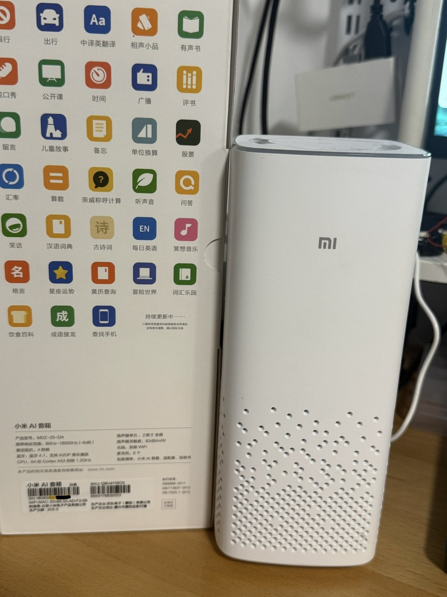

# 小米 AI 音箱 LLM 助手

> Bring your own LLM to a Xiaomi AI Speaker — keep "小爱同学" for what it's good at, route everything else to DeepSeek / MiniMax / Claude. Documentation is in Chinese.



让一台 2019 年的小米 AI 音箱（MDZ-25-DA / S12A）接上现代大模型：

- **原生能做的，继续交给小爱**：唤醒、开关灯、音量、天气、闹钟等走小米原生链路，体验不打折。
- **原生不会答的，转给 LLM**：拦截"我还在学习中"这类失败播报，**音箱自己直连 LLM**（DeepSeek / MiniMax / Claude / OpenAI）拿回答，再合成语音播放。TTS 独立选择：可走 Mac/迷你服务端 EdgeTTS，也可走音箱端 `ettsc` 直连 EdgeTTS，失败时兜底小爱原生 `mibrain` TTS。也保留"经 Mac 调 LLM"作为辅助/回退。

实际体验：

```text
小爱同学，开灯              → 灯开了（原生，毫秒级）
小爱同学，今天天气怎么样      → 原生播报天气
小爱同学，呼叫 DeepSeek     → 原生不支持，转 LLM："我在，有什么可以帮你？"
小爱同学，给我讲讲量子纠缠    → LLM 流式回答，逐句合成播放
```

## 工作原理

```text
"小爱同学" 唤醒
  → 小米原生 ASR/NLP 先处理
  → native_first_client.sh（音箱端，纯 shell）读取原生结构化结果
       → 原生成功 domain（家电/天气/音量…）：交回原生，replay 播报
       → 原生不支持：冻结失败播报，音箱自己直连 LLM 拿回答（主线）
  → 交给 TTS_ENGINE：server 微服务 / device 端侧 ettsc / 原生 mibrain 兜底
  → 音箱播放
```

主线是**音箱直连 LLM**（`LLM_PIPELINE=native`）：音箱脱离开发 Mac 独立运行，TTS 由 `TTS_ENGINE` 决定。两条链路对比见 [docs/concepts/native-first.md](docs/concepts/native-first.md)。

| TTS 路线 | 配置 | 适合场景 |
|---|---|---|
| Mac/迷你 TTS 服务端 EdgeTTS | `TTS_ENGINE=server` | 想要服务端切句流式、方便在 Mac 上更新 EdgeTTS 音色 |
| 音箱端直连 EdgeTTS | `TTS_ENGINE=device` | 不想部署 Mac 服务端，但仍想用 EdgeTTS 音色；需先构建并部署 `/data/ettsc` |
| 小爱原生 TTS 兜底 | `TTS_FALLBACK_NATIVE=1` | EdgeTTS 服务不可用或端侧失败时保证 LLM 回答不哑 |

另保留**经 Mac 调 LLM**（`LLM_PIPELINE=server`）作开发联调 / 回退。

这条 **native-first（原生优先）** 路线的核心判断：不要替换小爱，而是复用它最稳的部分——高质量唤醒、原生 ASR 和家电控制——只接管它不擅长的开放问答。路由依据是小米 NLP 的结构化 `domain/action` 字段，不是文本关键词猜测。详见 [docs/concepts/native-first.md](docs/concepts/native-first.md)。

## 硬件与风险声明

**适用设备**：小米 AI 音箱（本项目实测机型，其他型号思路可参考但命令不能照搬）。实测硬件参数：

| 项 | 值 |
|---|---|
| 产品型号 | MDZ-25-DA |
| 系统 hostname / 内部代号 | S12A |
| PCB 丝印 | `DKSND-S12C-ECHO-AB-20180820` |
| 主控 SoC | Amlogic A113X（四核 Cortex-A53） |
| 内核 | Linux 4.9.61 (aarch64) |
| WiFi / 蓝牙 | Marvell 88W8977-NMV2，双频 Wi-Fi 4 (802.11 a/b/g/n) + Bluetooth 5.2（含 BLE） |
| 存储 | 江波龙（Longsys）FORESEE 品牌 SPI NAND，1Gb（128MB），存 OS / 固件 / 启动代码（分区布局见 [docs/concepts/boot-and-partitions.md](docs/concepts/boot-and-partitions.md)） |
| 音频 ADC | ES7243 |
| 麦克风采集 | PDM，设备 `/dev/snd/pcmC0D2c`（被 `mipns` 独占） |
| 调试串口 | 主板 JST 插座，115200 8N1 |


上图是拆开后的 S12A 主板参考，左下角白色 JST 插座为调试串口位置；不同批次的丝印和插座朝向可能略有差异，接线前先确认 `TX/RX/GND`。

> 型号标识有不一致：PCB 丝印是 `S12C-ECHO`、系统 hostname 是 `S12A`、产品型号是 `MDZ-25-DA`。这里如实并列，以实测为准。

**风险声明**：

- **需要拆机接串口，但不用焊接**——主板上有现成的 JST 串口插座,用杜邦线把 USB‑TTL 模块（如 CH340）的 `TXD/RXD/GND` 插上去即可。串口是打通 SSH 之前唯一的控制通道，也是刷写出错后唯一的救援通道。
- 过程涉及 **读写 NAND 系统分区**，操作失误可能导致设备无法启动（变砖）。本仓库操作手册都附带了备份和回退步骤，但请确保理解每条命令再执行，风险自担。
- 改造不影响小爱原有功能，但显然会失去保修。

## 开源与法律免责声明

本项目是个人自有设备的本地研究和学习项目，**不隶属于、关联于或代表小米/小爱官方**。仓库中的“小米”“小爱同学”等名称仅用于说明兼容设备和技术背景。

请在使用或二次分发前理解以下边界：

- 仅在你拥有或已获授权的设备上使用本项目。不要用于未经授权的设备访问、批量控制、绕过他人设备安全限制或任何商业化远程控制服务。
- 本仓库不应包含、分发或托管任何小米固件镜像、系统分区 dump、私有二进制、模型文件、证书、密钥、账号 token、设备序列号或其他非公开资产。
- 本项目可能改变设备启动流程、启用 SSH、修改系统分区或调用本地原生服务；这些操作可能导致设备不可用、数据丢失、保修失效或违反相关服务条款，风险由使用者自行承担。
- 语音、文本、设备控制请求可能被发送到你自行配置的第三方 LLM/TTS/ASR 服务。请在使用前理解对应服务的数据处理和隐私政策，避免上传敏感语音、家庭信息、儿童信息或他人个人信息。
- 请勿将本项目用于攻击、扫描、入侵、破坏、干扰他人设备或服务；如发现安全问题，建议遵循负责任披露原则。

如果你计划公开分发修改版，请只发布自己编写的代码、配置模板和研究说明；不要把从设备中提取的小米原厂文件或个人隐私数据一并发布。

## 许可证

本仓库**自有代码**以 [MIT 许可证](LICENSE) 开源——可自由使用、修改、商用、再分发，只需保留版权与许可声明。

边界说明：MIT 仅覆盖本仓库自己编写的代码；引用的第三方项目、Rust/Python 依赖各自适用其原有许可证；上文免责声明中关于「不分发小米原厂文件/隐私数据、不用于未授权设备」的约定仍然有效。

## 从哪里开始读

| 你是谁 | 从这里开始 |
|---|---|
| 手里有音箱，想从零打通 | [docs/getting-started/bringup.md](docs/getting-started/bringup.md) —— 串口 → SSH → 部署 → 第一次 LLM 响应的完整路线图 |
| SSH 已可用，想快速跑起来 | [docs/getting-started/quickstart.md](docs/getting-started/quickstart.md) |
| 想先理解原理再动手 | [docs/concepts/native-first.md](docs/concepts/native-first.md) + [docs/concepts/boot-and-partitions.md](docs/concepts/boot-and-partitions.md) |
| 日常操作 / 出了问题 | [docs/runbooks/operations.md](docs/runbooks/operations.md) / [docs/runbooks/troubleshooting.md](docs/runbooks/troubleshooting.md) |
| 想看这一切是怎么一步步摸索出来的 | [docs/history/journey.md](docs/history/journey.md) —— 从接串口到 native-first 的完整探索历程 |

完整文档地图和阅读路径见 [docs/README.md](docs/README.md)。

## 仓库结构

```text
server/                 Mac FastAPI 服务端：LLM 路由、流式 TTS、Whisper ASR 兜底
device/                 音箱端脚本：native_first_client.sh 主客户端、配置模板、探索用 probe 脚本
docs/
  getting-started/      从零打通、快速上手
  concepts/             native-first 架构、启动链路与分区、术语表
  runbooks/             日常运维、SSH 注入、自启动、排障
  history/              探索历程与已验证失败的路线
  archive/              重构前文档原貌快照（查证用）
tests/                  自动化测试 + 真实音箱人工用例
config.yaml             LLM / ASR / TTS 配置
start_server.sh         Mac 服务端启动入口
```

## 快速启动（已完成部署时）

可选：Mac/迷你 TTS 服务端（`TTS_ENGINE=server` 时使用，仓库根目录）：

```sh
./start_server.sh
```

这一步是可选的：也可以用 `TTS_ENGINE=device` 让音箱端 `ettsc` 直连 EdgeTTS；两种 EdgeTTS 失败时都可用 `TTS_FALLBACK_NATIVE=1` 退回小爱原生 TTS。

音箱端（SSH 登录后）：

```sh
SERVER=http://192.168.8.150:8080 BACKEND=deepseek \
sh /data/native_first_client.sh > /tmp/native_first_client.log 2>&1 &
tail -f /tmp/native_first_client.log /tmp/native_first_events.log
```

> 文档中的 IP（Mac `192.168.8.150`、音箱 `192.168.8.152`）均为示例，替换成你自己的。约定见 [docs/README.md](docs/README.md#文档约定)。

完整步骤见 [docs/getting-started/quickstart.md](docs/getting-started/quickstart.md)。

## 服务端能力

- **TTS 服务（`TTS_ENGINE=server` 用）**：纯文本 → 流式 WAV，按中文句子边界切分逐句 EdgeTTS 合成（默认音色 `zh-CN-YunjianNeural`），首句即可开播。未部署或不可达时，音箱可自动走端侧/原生兜底。
- **LLM + TTS 一体（server 辅助模式用）**：接收音箱 fallback 文本，调 DeepSeek / MiniMax / OpenAI / Claude（`config.yaml` 配置，`.env` 放 key）后流式合成。
- 保留 Whisper ASR 接口，作为历史路线、测试和兜底能力。

| 端点 | 用途 |
|---|---|
| `GET /` | 健康检查 |
| `POST /api/v1/tts/stream` | **native 主线 TTS**：纯文本→流式 WAV（不含 LLM），供音箱直连 / 可移植迷你 TTS 服务 |
| `POST /api/v1/stream/text_chat` | server 辅助链路：文本进 LLM，流式返回 TTS 音频 |
| `POST /api/v1/route/asr` | 录音 ASR + 路由（测试/兜底） |
| `POST /api/v1/stream/chat` | 录音上传 → ASR → LLM → TTS 一体化（历史接口） |

## 测试

```sh
./scripts/run_tests.sh                    # 自动化：服务端逻辑 + shell 语法 + 配置一致性
tests/manual_native_first_cases.md        # 真实音箱人工用例
```

说明见 [TESTING.md](TESTING.md)。

## 当前边界

- native-first 首轮 fallback 是稳定主线；boot0 与 boot1 两套系统（2019/2023 ROM）均已适配。
- **音箱直连 LLM（`LLM_PIPELINE=native`）是当前主线**：LLM 由音箱 shell 直接调用。TTS 可选 `server`（Mac/迷你服务端 EdgeTTS）、`device`（音箱端 `ettsc` 直连 EdgeTTS）或原生 `mibrain` 兜底。`server` 模式（经 Mac 调 LLM）保留作开发联调 / 回退。详见 [docs/concepts/native-first.md](docs/concepts/native-first.md)。
- 连续追问（LLM 回答后不喊唤醒词直接追问）**未解决**：boot1 上免唤醒开麦的设备端手段（oneshot / event_notify / continuous reopen）经对照实验确认不通，唯一可工作的 ExpectSpeech 归云端控制；boot0 有实验性本地录音方案。详见 [docs/history/followup-exploration.md](docs/history/followup-exploration.md)。

## 与同类项目对比

小爱接入 LLM 大致有三条路线：**云账号**（[mi-gpt](https://github.com/idootop/mi-gpt) / [xiaogpt](https://github.com/yihong0618/xiaogpt)，不碰硬件、用账号当遥控器）、**刷机接管**（[open-xiaoai](https://github.com/idootop/open-xiaoai)，夺麦克风/扬声器）、**本机原生优先**（本项目，音箱本机读小米 NLP 结果、只接管它答不了的）。

| 维度 | **本项目** | open-xiaoai | mi-gpt | xiaogpt |
|---|---|---|---|---|
| 接入原理 | 本机 shell 读原生 NLP 结构化结果 | 刷机接管麦克风/扬声器 | 云账号 API 控制 | 云账号轮询对话记录 |
| 需要 root/刷机 | 拿 root，不全量刷机 | **全量刷机** | 不需要 | 不需要 |
| 需要常驻电脑 | **不需要** | 需要 Server | 需要 PC/NAS | 需要 PC/Docker |
| 依赖小米云账号 | **不依赖** | 不依赖 | 依赖 | 依赖 |
| 支持设备 | 仅 MDZ-25-DA/S12A 老机 | 仅 2 款新机 | 多数机型 | 多数机型 |
| 路由策略 | **按 NLP domain/action 分流** | 全量接管 | 关键词触发 | 关键词触发 |
| 连续对话 | boot0 本地录音（实验性） | 真打断 | ✅ | ✅ |
| 维护状态 | 活跃 | 已停更 | 已停更 | 活跃 |

本项目的取舍：**自治度最高**（不要电脑、不要云账号、不过小米云），代价是**最难装**（拆机接串口）且**只支持一款老机**——定位是给被主流方案抛弃的老音箱续命。完整对比（三种哲学、独有优势、可借鉴方向）见 [docs/concepts/comparison.md](docs/concepts/comparison.md)。

## 相关项目

本项目在探索过程中参考了这些开源工作，特此致谢：

- [open-xiaoai](https://github.com/idootop/open-xiaoai) —— 小爱音箱接入大模型的先行项目，自启动 `/data/init.sh` 方案来源
- [duhow/xiaoai-patch](https://github.com/duhow/xiaoai-patch) —— squashfs 解包/注入/写回路线参考
- [open-lx01](https://github.com/jialeicui/open-lx01) —— rootfs 只读、`/data` 可写的结论印证
- [xiaoai-crack](https://github.com/birdsofsummer/xiaoai-crack) —— ubus 接口调用参考
