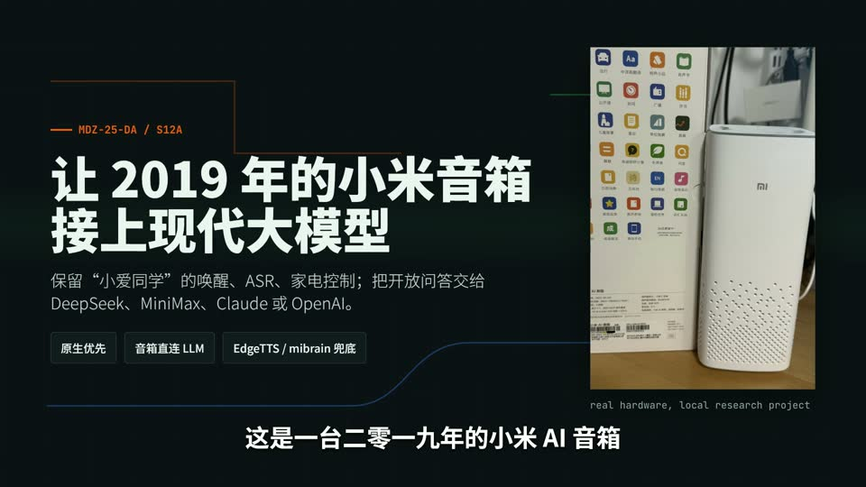
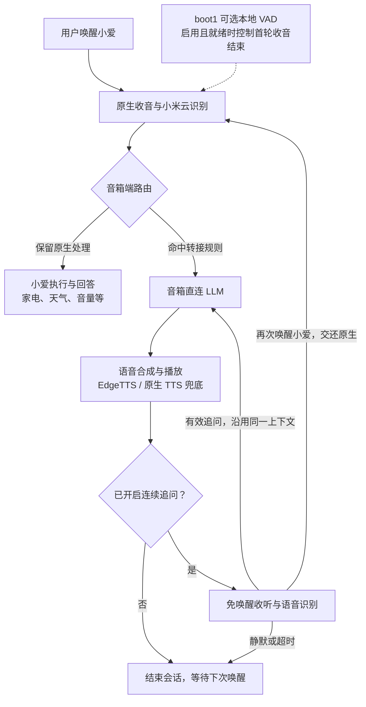

# 小米 AI 音箱 LLM 助手

> Bring your own LLM to a Xiaomi AI Speaker. 保留小爱的日常能力，为老音箱接上大模型。

一台 2019 年的小米 AI 音箱，还能继续做什么？这个项目从日常使用出发：开灯、调音量、问天气，继续交给熟悉的小爱；想聊一个开放问题时，让音箱连接自己的 LLM 服务，把回答念出来，并接着聊下去。

[](https://www.bilibili.com/video/BV1Vzja69ELB/)

▶️ [观看完整演示](https://www.bilibili.com/video/BV1Vzja69ELB/)

## 用起来是什么样

```text
小爱同学，开灯                         → 小米原生执行
小爱同学，今天天气怎么样               → 小米原生回答
小爱同学，问问 DeepSeek，介绍一下西湖   → 大模型回答并播报
回答结束、绿灯续听时：那什么时候去呢？ → 沿用同一上下文继续聊
保持安静                               → 结束追问，回到待机
```

连续追问需要安装并启用对应组件。boot1 还可以增加首轮停顿续说：说到一半停约 1.5 秒，再轻声补充，音箱会继续收听；它按语音活动判停，不判断句意是否完整。

## 工作原理

项目采用 **native-first（原生优先）**：复用小米的唤醒、识别和设备控制，音箱上的客户端按规则选择原生处理或转入 LLM。LLM 回答通过语音合成播放，播放完成后再进入追问窗口。


```mermaid
flowchart TD
    wake["用户唤醒小爱"] --> speech["原生收音与小米云识别"]
    vad["boot1 可选本地 VAD<br/>启用且就绪时控制首轮收音结束"] -.-> speech
    speech --> route{"音箱端路由"}
    route -->|保留原生处理| native["小爱执行与回答<br/>家电、天气、音量等"]
    route -->|命中转接规则| llm["音箱直连 LLM"]
    llm --> tts["语音合成与播放<br/>EdgeTTS / 原生 TTS 兜底"]
    tts --> followup{"已开启连续追问？"}
    followup -->|是| listen["免唤醒收听与语音识别"]
    followup -->|否| idle["结束会话，等待下次唤醒"]
    listen -->|有效追问，沿用同一上下文| llm
    listen -->|静默或超时| idle
    listen -->|再次唤醒小爱，交还原生| speech
```

主线是**音箱直连 LLM**。搭配设备端 EdgeTTS 和原生追问，可以不运行常驻 Mac；开发电脑只用于构建、部署和维护。小米云识别、所选 LLM 与 TTS 云服务仍需要网络，模型并非都在音箱本地运行。可选服务端用于 TTS、联调或回退。

想继续了解分支如何判断、首轮和追问有什么区别，读[一次对话的完整过程](docs/concepts/native-first.md)。

<a id="硬件与风险声明"></a>
<a id="首轮停顿续说"></a>
<a id="当前边界"></a>

## 开始之前，先确认适用范围

目前实测设备是 **MDZ-25-DA / S12A**。安装需要拆机接串口、建立 SSH，并可能修改系统分区；已有主板插座可免焊接，但写入错误仍可能导致无法启动。先阅读[设备与准备](docs/reference/hardware.md)，确认备份和恢复条件，再进入安装步骤。

核心问答、boot1 上下文追问、首轮本地判停已有实机记录，整机重启和断电冷启动恢复也已核验。全天稳定性、更多噪声与距离条件仍待验证；尚未实现停止 LLM 的播放中语音打断。完整的双系统能力、验收证据和剩余边界统一维护在[当前状态](docs/status.md)。

## 从哪里开始读

| 你现在的位置 | 下一步 |
|---|---|
| 想先理解整个项目 | [文档导读](docs/README.md)：按问题逐层展开 |
| 手里有音箱，还没有 SSH | [从零接入](docs/getting-started/bringup.md)：先取得可靠的维护入口 |
| SSH 已可用，准备第一次部署 | [跑通第一轮对话](docs/getting-started/quickstart.md) |
| 首轮已可用，想增加追问与停顿续说 | [逐步完善对话](docs/getting-started/conversation.md) |
| 已部署，想维护或排障 | [日常操作](docs/runbooks/operations.md) / [排障](docs/runbooks/troubleshooting.md) |
| 想了解探索过程 | [从串口到原生优先的故事](docs/history/journey.md) |

<a id="快速启动已完成部署时"></a>
<a id="服务端能力"></a>
<a id="与同类项目对比"></a>
<a id="测试"></a>

## 仓库结构

| 目录或文件 | 负责什么 |
|---|---|
| `device/` | 音箱主客户端、原生 ASR、判停、TTS 和播放适配 |
| `server/` | 可选 FastAPI 服务，入口和接口见[服务端参考](docs/reference/server.md) |
| `tools/speaker-maintenance/` | 固件补丁、组件安装和维护检查 |
| `docs/` | 阅读路径、原理、操作、参考与历史证据 |
| `tests/`、`TESTING.md` | 自动化回归与[实机验收方法](TESTING.md) |
| `device/native_first.env.example`、`config.yaml` | 设备和服务端的[配置入口](docs/reference/configuration.md) |

选择接入路线时，可继续阅读[本项目的取舍](docs/concepts/comparison.md)。

## 开源与法律免责声明

本项目是个人自有设备的本地研究和学习项目，**不隶属于、关联于或代表小米/小爱官方**。仓库中的“小米”“小爱同学”等名称仅用于说明兼容设备和技术背景。

请在使用或二次分发前理解以下边界：

- 仅在你拥有或已获授权的设备上使用本项目。不要用于未经授权的设备访问、批量控制、绕过他人设备安全限制或任何商业化远程控制服务。
- 本仓库不应包含、分发或托管任何小米固件镜像、系统分区 dump、私有二进制、模型文件、证书、密钥、账号 token、设备序列号或其他非公开资产。
- 本项目可能改变设备启动流程、启用 SSH、修改系统分区或调用本地原生服务；这些操作可能导致设备不可用、数据丢失、保修失效或违反相关服务条款，风险由使用者自行承担。
- 语音、文本、设备控制请求可能被发送到你自行配置的第三方 LLM/TTS/ASR 服务。请在使用前理解对应服务的数据处理和隐私政策，避免上传敏感语音、家庭信息、儿童信息或他人个人信息。
- 请勿将本项目用于攻击、扫描、入侵、破坏、干扰他人设备或服务；如发现安全问题，建议遵循负责任披露原则。

如果你计划公开分发修改版，请只发布自己编写的代码、配置模板和研究说明；不要把从设备中提取的小米原厂文件或个人隐私数据一并发布。

## 许可证

本仓库**自有代码**以 [MIT 许可证](LICENSE) 开源——可自由使用、修改、商用、再分发，只需保留版权与许可声明。

边界说明：MIT 仅覆盖本仓库自己编写的代码；引用的第三方项目、Rust/Python 依赖各自适用其原有许可证；上文免责声明中关于「不分发小米原厂文件/隐私数据、不用于未授权设备」的约定仍然有效。

## 相关项目

本项目在探索过程中参考了这些开源工作，特此致谢：

- [open-xiaoai](https://github.com/idootop/open-xiaoai) —— 小爱音箱接入大模型的先行项目，自启动 `/data/init.sh` 方案来源
- [duhow/xiaoai-patch](https://github.com/duhow/xiaoai-patch) —— squashfs 解包/注入/写回路线参考
- [open-lx01](https://github.com/jialeicui/open-lx01) —— rootfs 只读、`/data` 可写的结论印证
- [xiaoai-crack](https://github.com/birdsofsummer/xiaoai-crack) —— ubus 接口调用参考
