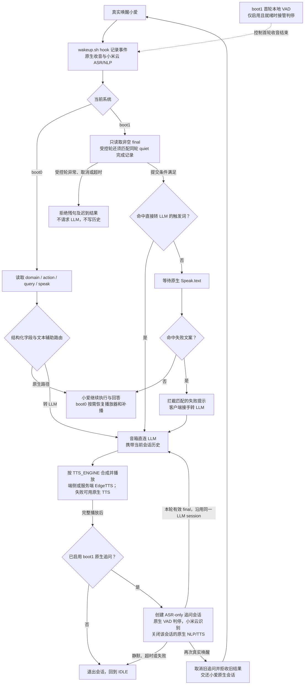

# 一次对话的完整过程

理解这个项目，可以从用户的一句话开始：小爱先听见它，原生服务完成识别，客户端决定由谁回答，最后再决定是否继续收听。各组件围绕这条链路协作。本文解释机制；安装看[上手路线](../getting-started/bringup.md)，验收进度看[当前状态](../status.md)。

## 1. 先保留音箱已经擅长的部分

小米原生链路掌握唤醒、麦克风前端、语音识别、家电和设备上下文。native-first 复用这些能力，用 LLM 补充开放问答。音箱本机运行客户端与适配组件，联网请求模型；这不等于在音箱上运行大语言模型。

主状态机在 `device/native_first_client.sh`。boot0 与 boot1 的原生用户态不同，客户端需要使用不同结果源；两套系统及共享 `/data` 的关系见[启动链路](boot-and-partitions.md)。

## 2. 把主线连起来

图中展开双系统首轮路由，并以 boot1 原生实时 ASR 展示连续追问。LLM/TTS 画出音箱直连主线；可选服务端职责见[回答与播放](#回答与播放)。

原生家居动作仍由小米执行链路完成。图中省略 LLM/播放失败与有限短句补全等分支；“未命中失败文案”不代表原生一定答对。boot0 的追问沿用录音与文件 ASR，不走图中的 boot1 ASR-only 组件。

## 3. 唤醒之后，什么时候算说完

原生链路调用 `/bin/wakeup.sh` 时，客户端通过 bind mount 的 hook 记录事件。boot0 常见 `WuW`；boot1 有时只有 `think/ready`，客户端按系统适配。hook 不需要每次改写只读 rootfs。

### 首轮收音与结果提交

提前回应可能发生在两个位置：客户端把尚未定稿的 partial 当作问题，或原生收音已经在句中停顿时结束。只改为等待 final，可以解决前者，却无法找回没有继续上传的声音。

boot1 客户端只提交非空 final。可选 `native_endpoint` 再把收音结束交给本机 Silero VAD：模型观察原生处理后的 PCM，小米云继续识别文字。仅启用且就绪时接管真实唤醒首轮；未就绪的新唤醒保留原生收音。

| 判定 | 当前行为 |
|---|---|
| 首帧起约 6 秒未开口 | 无语音退出，不请求 LLM |
| 检测到语音后约 2 秒静音 | 提出正常句末候选 |
| 唤醒后整轮约 20 秒 | 达到上限，拒绝残句 |
| 故障、过载或再次唤醒取消 | 拒绝旧轮，迟到结果也不能补交 |

结束候选还要经过原生入口复核：同一轮身份、帮助进程存活、提议时效和音频消费进度都必须匹配。临时积压最多容纳 500 ms，必须追平全部音频才可判停；超载拒绝该轮，不跳帧冒充已经听完。

对受控首轮，**同一 dialog 的正常 quiet 完成记录与非空 final 同时具备**，才允许进入原有 LLM 路由。拒绝记录会跨恢复保留，避免旧请求在进程重建后重放。VAD 判断的是语音活动，超过约 2 秒的长停顿仍可能结束，原生命令也会承担句末等待。

这里与 `NATIVE_DIALOG_INPUT_GUARD` 的作用不同：后者只对“帮我查一下”等少数明确缺内容的短句提示补充，无法恢复已经停止上传的音频。构建、资源、固件与安装限制见 [native_endpoint](../../device/native_endpoint/README.md)；研究证据见[首轮判停专题](../history/first-turn-endpoint/README.md)。

## 4. 识别之后，交给谁回答

| 系统 | 客户端读取什么 | 怎样决定路由 |
|---|---|---|
| boot0 / system0 | `mibrain nlp_result_get` 的 `domain/action/query/to_speak` | 先判断失败文本或 `michat/model`，再看原生能力白名单，其他转 LLM |
| boot1 / system1 | AIVS 日志的非空 final `RecognizeResult` 与 `Speak.text` | 先看直接转 LLM 的触发词，否则等待并匹配失败 Speak 文案 |

boot0 的 `domain` 是能力类别，不是统一的成功标志；`qabot/query` 可以对应正常回答，也可以对应失败提示。日志中 `query=token` 也可能只是内部占位值。客户端需要结合文本和规则，不能只看一个字段。

boot1 默认直接触发词匹配 DeepSeek 的大小写写法。没有命中时，匹配 `UNSUPPORTED_PATTERNS` 才接管失败回答；尚无已验证的通用业务失败字段替代该规则。适配器填入的 `michat/model` 是内部路由标记，不是固件返回的失败状态。

`NATIVE_RESULT_SOURCE=auto` 按根分区选择结果源。boot1 不照搬 boot0 的 `think` 预冻结，也跳过不兼容的 dsnoop/音频库覆盖；提前冻结或复制旧系统原生库，可能影响原生识别。应保留两套适配，不用一套系统的二进制“补齐”另一套。

功能与验收差异统一列在[双系统能力表](../status.md#双系统能力对照)。

## 5. 回答和播放怎样衔接

先控制原生失败播报，才能避免它与 LLM 回答重叠。boot0 在 `think` 阶段预冻结播放器，路由后恢复或接管；boot1 的匹配固件组件可在解析入口提前拦截，`aivs_guard` 另监听日志作后备。两者都依赖同一份文本规则，未知文案或相似正常回答仍可能漏判、误判。

LLM 请求与播放使用 busy 标记区分自有回答；LLM 文本不会被当成新的原生失败文案。部分控制类短播报支持下一次唤醒取消旧播报，天气等纯语音结果不应放入同一取消列表。

接下来是两个独立选择：谁调用模型，以及 native 主线的声音从哪里来。

| 链路 | 运行方式 |
|---|---|
| `LLM_PIPELINE=native` | 音箱直接调用 LLM，携带本轮会话历史 |
| `LLM_PIPELINE=server` | 音箱发文字给 FastAPI，由服务端完成 LLM 与 TTS |
| native 下 `TTS_ENGINE=device` | 音箱 `ettsc` 调 EdgeTTS，可逐句合成 PCM 并按序播放 |
| native 下 `TTS_ENGINE=server` | 将文字交给 TTS 服务，服务端切句并返回语音流 |

端侧 `ettsc` 当前使用阻塞 IO、同步 WebSocket 和 rustls 内置根证书。早期 OpenSSL 与 tokio 的实验属于历史，不是当前依赖；构建细节见 [ettsc](../../device/ettsc/README.md)。

端侧逐句链路可以同时播放当前句和合成下一句。单句合成失败先重试，再在排空 PCM 后按序尝试原生 TTS；补播或播放失败会结束本轮，避免把未完成的回答记成完整历史。历史播放卡顿仍有独立待办，不从这套恢复机制推断所有停顿已消失。

会话历史默认放在 `/tmp/native_first_llm_hist`，保留最近 6 轮，整机重启会清空。配置选择见[配置参考](../reference/configuration.md)，可选接口见[服务端参考](../reference/server.md)。

## 6. 回答之后，怎样继续聊

boot1 播放完整结束后，已启用的原生追问组件主动创建一个 NONWAKEUP、ASR-only 会话。它使用原生麦克风前端和小米云识别，只关闭该会话的 NLP/TTS，把有效最终文本送进同一个 LLM session，再播放、再续听。

首轮本地判停不接管这个入口。追问仍由原生 VAD 控制，空闲约 6 秒，20 秒是整轮保护超时。保持安静会退出；组件按请求身份隔离旧文本和迟到指令。

如果续听期间再次真实唤醒“小爱同学”，组件先取消旧追问，释放归属与 busy，再交还原生会话。交接后旧轮清理不能影响新一轮。播放中并行唤醒使用另一路原生回调与 AEC 参考，不等于已经支持暂停或停止 LLM；“退下”等结束语仍按普通追问交给模型。

组件还隔离自有追问的提示音、管理会话音量与正常结束指令；详细 ABI 和状态设计见 [native_asr](../../device/native_asr/README.md)。boot0 保留录音与文件 ASR；旧 PCM + Mac 识别作为回退，不与当前 boot1 管理器同时加载。

## 7. 用户能看到什么反馈

| 阶段 | 默认灯效 |
|---|---|
| 唤醒、原生处理中 | 蓝灯 |
| 转入 LLM、追问识别成功 | 绿色快闪后转绿 |
| LLM 生成与播放 | 绿色转圈 |
| 可以继续追问 | 绿灯常亮 |
| 出错或无文本退出 | 橙色快闪后灭 |
| 回到待机 | 灭灯 |

客户端通过 LED sysfs 显示这些状态；不支持时跳过，`LED_FEEDBACK_ENABLED=0` 可关闭。灯色是交互提示，不能替代组件健康检查。节奏参数见[配置模板](../../device/native_first.env.example)。

读到这里，已经能沿着一轮对话定位组件职责。接下来可看[系统如何启动它们](boot-and-partitions.md)，或进入[日常操作](../runbooks/operations.md)把这些概念对应到状态与日志。
