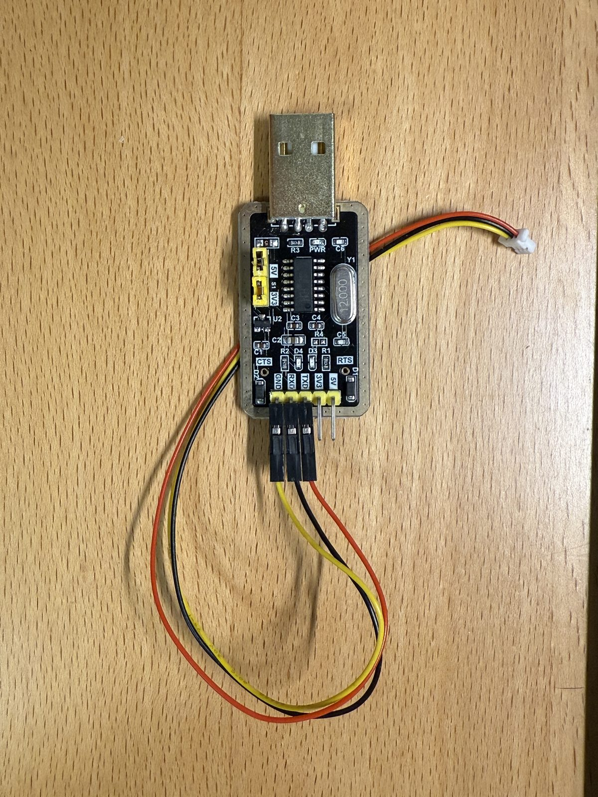
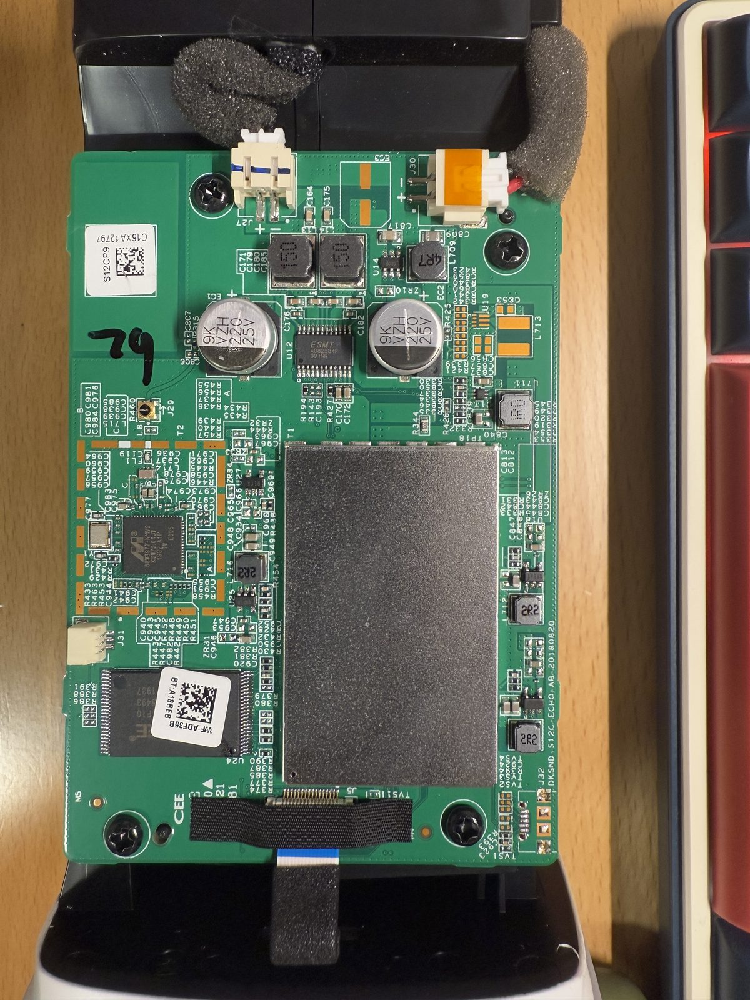

# 从零打通小爱音箱到 LLM

文档类型：从零接入路线图
适用范围：手里有一台小米 AI 音箱（MDZ-25-DA / S12A），想让它接入自己的 LLM 服务端
当前结论：先打通 boot0 SSH，再补齐 boot1 SSH，之后把客户端脚本放到 `/data`，最后配置自启动

> 本文是总路线图：每一步说清"做什么、为什么、怎么判断成功"，写镜像等高风险细节交给对应 runbook。示例 IP 等约定见 [../README.md](../README.md#文档约定)。

## 1. 最终要实现什么

```text
小爱同学，开灯              → 仍然走小米原生，灯能打开
小爱同学，今天天气怎么样      → 仍然走小米原生，播报天气
小爱同学，呼叫 DeepSeek     → 小米原生不会处理
                            → native-first 拦截失败播报
                            → 把"小米识别出的文字"转给 Mac LLM
                            → 音箱播放 LLM 回答
```

这不是把小爱替换掉，而是让小爱先处理它擅长的事，处理不了再转 LLM。原理见 [../concepts/native-first.md](../concepts/native-first.md)。

## 2. 完整路线图

一台新音箱通常没有 SSH，不能 `scp` 上传脚本；只靠串口传文件又慢又不可持续。音箱还有两套系统（boot0/boot1），异常时可能自动切换——只打通一边的 SSH，切过去就失联，又得接串口。所以完整路线是：

```text
拆机接串口（TTL，插座免焊）
  → boot0/failsafe 打通 SSH        ← runbooks/boot0-ssh.md
  → 用 SSH 上传脚本到 /data
  → 启动 Mac 服务端和音箱客户端
  → 验证 native-first 主流程
  → 打通 boot1 SSH                 ← runbooks/boot1-ssh.md
  → 验证 boot0/boot1 都能跑
  → 配置 /data/init.sh 自启动      ← runbooks/autostart.md
```

为什么有两套系统、它们差在哪，见 [../concepts/boot-and-partitions.md](../concepts/boot-and-partitions.md)。

## 3. 准备 Mac 环境

在仓库根目录：

```sh
python3 -m venv .venv
.venv/bin/pip install -r requirements.txt
cp .env.example .env
```

在 `.env` 中填入至少一个 LLM key，例如：

```text
DEEPSEEK_API_KEY=...
```

启动服务并做健康检查：

```sh
./start_server.sh
curl http://127.0.0.1:8080/
```

## 4. 先通过串口进入音箱

拆开音箱后盖，主板上有现成的 **JST 串口插座，不用焊接**——用杜邦线把 USB-TTL 模块（如 CH340）的 `TXD/RXD/GND` 三根线插上去即可（注意模块 TXD 接音箱 RXD、RXD 接音箱 TXD，GND 对 GND），波特率 115200、8N1。打通 SSH 之前，这是唯一的控制通道；之后它仍是刷写出错时唯一的救援通道，整个过程请保持串口可用。

实物参考：



上图是 CH340 一类 USB-TTL 模块的接线示例，只需要接 `TXD/RXD/GND` 三根线；`TXD` 和 `RXD` 要与音箱侧交叉连接，`GND` 共地，`5V/3V3` 不需要接到音箱主板。



上图是拆开后的 S12A 主板参考，串口使用主板上的白色 JST 插座。不同批次的丝印和插座朝向可能略有差异，接线前先确认 `TX/RX/GND`，不要把电源脚误接到串口线上。

Mac 查看串口并连接：

```sh
ls /dev/tty.*
screen /dev/tty.usbserial-3120 115200
```

退出 screen：`Ctrl+A → K → Y`。

如果需要进入 failsafe，优先切回 boot0。进入 U-Boot（启动时按任意键中断）后：

```text
s12# setenv boot_part boot0
s12# saveenv
s12# reset
```

看到 `Press the [f] key and hit [enter]` 时立即按 `f → Enter`。

## 5. 打通 boot0 SSH

boot0 SSH 是后续高效开发的第一道门。完整操作手册（含原理、风险、备份、回退）：

→ [../runbooks/boot0-ssh.md](../runbooks/boot0-ssh.md)

打通后，建议在 Mac 的 `~/.ssh/config` 配置 `xiaomi` 别名（见 [../README.md](../README.md#文档约定)），然后验证：

```sh
ssh xiaomi
```

如果提示 host key 冲突：

```sh
ssh-keygen -R 192.168.8.152
```

## 6. 上传音箱端文件并首次联调

SSH 可用后，按 [quickstart.md](quickstart.md) 完成：上传 `/data` 脚本、编辑 `native_first.env`、启动客户端、看日志、跑三条验证用例。

判断标准：

- 开灯：原生成功，不应进 LLM。
- 天气：原生播报，不应进 LLM。
- 呼叫 DeepSeek：应进入 LLM。

跑完这一步，boot0 上的主流程就算打通了。

## 7. 打通 boot1

设备异常或系统策略可能让音箱启动到另一套系统。如果只在 boot0 有 SSH：

- 启动到 boot1 后 SSH 不进去，每次都要接串口切回，调试非常痛苦。
- native-first 在 boot0/boot1 上面对的小米原生结果源不同（2019 与 2023 ROM），必须分别验证。

长期方案是两边都能 SSH，共享 `/data` 里同一份客户端脚本，由脚本自动适配结果源。操作手册：

→ [../runbooks/boot1-ssh.md](../runbooks/boot1-ssh.md)

打通后切到 boot1，重复第 6 步的三条验证用例。SSH 下切换 boot 的命令见 [../runbooks/operations.md](../runbooks/operations.md#5-boot-分区切换)。

## 8. 配置断电自启动

没有自启动时，每次断电重启都要 SSH 手动启动客户端。长期方案：

- 在 system0/system1 的 `/etc/rc.local` 注入一行通用入口（只注入一次）。
- 真正的启动逻辑放在可写的 `/data/init.sh`，后续只改它。

部署模板：

```sh
cp /data/data_init_native_first.sh /data/init.sh
chmod +x /data/init.sh
sh /data/init.sh
```

rc.local 注入和验证见 → [../runbooks/autostart.md](../runbooks/autostart.md)

## 9. 下一步读什么

- 日常启动、停止、看日志、切 boot：[../runbooks/operations.md](../runbooks/operations.md)
- 出问题：[../runbooks/troubleshooting.md](../runbooks/troubleshooting.md)
- 想理解底层：[../concepts/boot-and-partitions.md](../concepts/boot-and-partitions.md)
- 想知道这条路线是怎么摸索出来的：[../history/journey.md](../history/journey.md)
