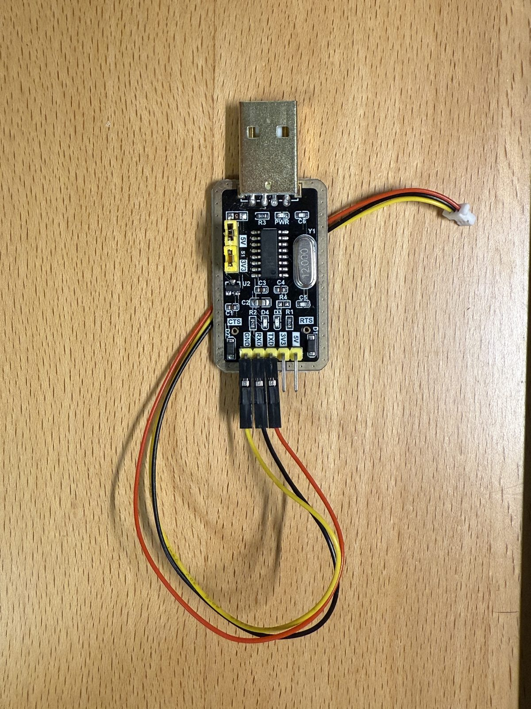
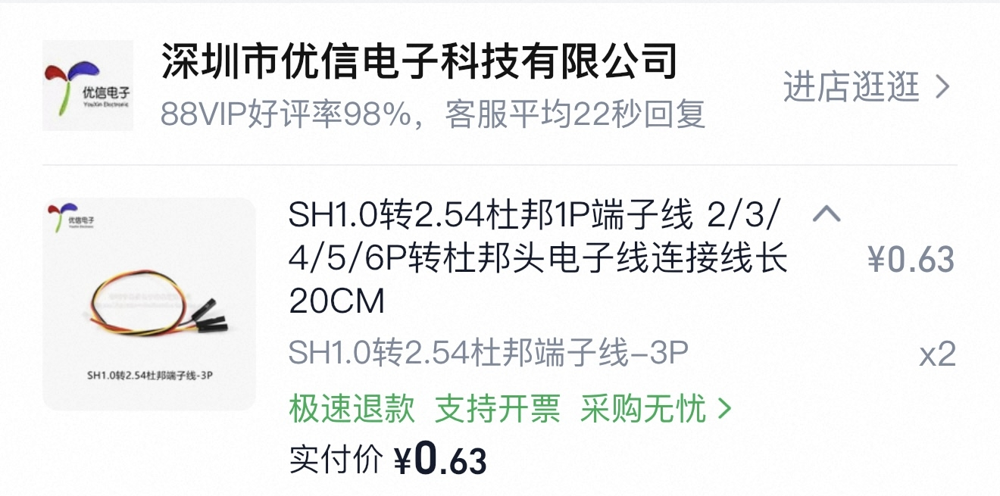

<a id="从零打通小爱音箱到-llm"></a>

<a id="1-最终要实现什么"></a>

<a id="2-完整路线图"></a>

<a id="3-准备-mac-环境"></a>

<a id="4-先通过串口进入音箱"></a>

<a id="5-打通-boot0-ssh"></a>

<a id="6-上传音箱端文件并首次联调"></a>

<a id="7-打通-boot1"></a>

<a id="8-配置断电自启动"></a>

<a id="9-下一步读什么"></a>

# 从零接入：先取得可靠的维护入口

第一次改造音箱，先解决的是“怎样进入设备，以及出问题后怎样回来”。拿到可靠的 SSH 入口后，再部署语音助手，最后补齐另一套系统和自启动。本文是路线图，分区写入的完整备份、校验与回退步骤留在对应操作手册。

开始前阅读[设备与准备](../reference/hardware.md)。如果 SSH 已经可用，直接前往[跑通第一轮对话](quickstart.md)。示例 IP 和登录别名见[文档约定](../README.md#文档约定)。

## 1. 先看要走过的几步

| 阶段 | 为什么需要 | 何时可以继续 |
|---|---|---|
| 串口与恢复 | SSH 尚未建立时，需要能看到启动过程并进入恢复入口 | 能读取日志、确认系统和恢复条件 |
| 首个系统的 SSH | 用网络可靠地备份和上传文件 | 可登录，已有可核验备份 |
| 第一轮问答 | 先验证原生与 LLM 两条链路 | 原生命令、天气、LLM 问答分别通过 |
| 另一套系统 | 设备可能切换启动槽位，只打通一边容易失联 | 两边均单独验证 SSH 与语音功能 |
| 追问和首轮判停 | 在基本闭环稳定后逐项改善对话 | 每个组件安装后独立验收 |
| 自启动 | 让部署在整机重启后仍可恢复 | 不手动启动也能完成真实对话 |

两套系统共用 `/data`，但原生服务版本不同；背景见[启动链路与双系统](../concepts/boot-and-partitions.md)。

## 2. 接上串口，确认恢复条件

拆开音箱后盖，主板上有现成的 **JST 串口插座，不用焊接**——用杜邦线把 USB-TTL 模块（如 CH340）的 `TXD/RXD/GND` 三根线插上去即可（注意模块 TXD 接音箱 RXD、RXD 接音箱 TXD，GND 对 GND），波特率 115200、8N1。打通 SSH 之前，这是唯一的控制通道；之后它仍是刷写出错时唯一的救援通道，整个过程请保持串口可用。

实物参考：



上图是 CH340 一类 USB-TTL 模块的接线示例，只需要接 `TXD/RXD/GND` 三根线；`TXD` 和 `RXD` 要与音箱侧交叉连接，`GND` 共地，`5V/3V3` 不需要接到音箱主板。


上图是拆开后的 S12A 主板参考，串口使用主板上的白色 JST 插座。不同批次的丝印和插座朝向可能略有差异，接线前先确认 `TX/RX/GND`，不要把电源脚误接到串口线上。

### 串口转接线采购参考

本项目实际购买并使用的是 **SH1.0 转 2.54 mm 杜邦端子线（3P、约 20 cm）**。购买平台上的商品标题和规格选项可能写作：

- 搜索关键词：`SH1.0 转 2.54 杜邦 3P 端子线 20CM`
- 实购规格选项：`SH1.0转2.54杜邦端子线-3P`
- 杜邦端选择：连接常见带排针的 USB-TTL 模块时，选 **2.54 mm 杜邦母头**



截图仅用于确认线材类型和检索关键词，店铺、价格及库存可能变化，不作为指定购买渠道。收到线后先用万用表确认三根线与插头针脚的对应关系；**不要只按线色判断 `TX/RX/GND`，也不要连接 USB-TTL 模块的 `5V/3V3` 电源脚。**

Mac 查看串口并连接：

```sh
ls /dev/tty.*
screen /dev/tty.usbserial-3120 115200
```

退出 screen：`Ctrl+A → K → Y`。


串口连接后先读取启动日志，确认设备、当前系统和可以使用的恢复入口。原始 boot0 固件曾提供 failsafe；如果 boot0 内核已经被替换，入口可能不存在。项目实机有过[原始 failsafe 丢失的记录](../history/journey.md#14-学费failsafe-永久丢失)，不能仅凭 `boot_part=boot0` 判断还能进入。

## 3. 打通第一套系统的 SSH

按 [boot0 SSH 手册](../runbooks/boot0-ssh.md)核对适用前提，完成临时入口、备份、SSH hook 和验证。若当前设备已在可用系统中提供 SSH，不为照搬路线重复刷写；按实际状态进入下一步。

在开发机配置 `xiaomi` 别名后，验证：

```sh
ssh xiaomi
```

首次连接需核对身份。主机密钥变化时先确认设备与系统切换原因，再处理旧记录；不要把清除主机密钥当作所有连接问题的修复。

## 4. 先跑通一轮原生与 LLM 问答

按[快速上手](quickstart.md)上传客户端、配置模型和 TTS，然后依次验证：原生家电命令、天气、带完整问题的 DeepSeek 调用。此时先不增加追问或判停，让问题能定位到一条清楚的链路。

开发电脑在这里负责部署。仅选择 server LLM/TTS 时，才需要[额外启动服务端](../reference/server.md)。

## 5. 补齐另一套系统

能够登录 boot0，并不能证明 boot1 也能登录；共享 `/data` 也不意味着原生语音服务相同。按 [boot1 SSH 手册](../runbooks/boot1-ssh.md)处理匹配固件，保持至少一套可启动系统和串口恢复条件。

切到 boot1 后，按快速上手的 [guard 步骤](quickstart.md#3-boot1-补齐失败提示拦截)安装快速拦截器，再重复三条首轮验证。两套系统要分别验收，不复制 boot0 的原生音频库覆盖 boot1。日后控制 OTA 和维护镜像见[双系统维护](../runbooks/owner-maintenance.md)。

## 6. 从可用走向日常使用

首轮通过后，按[逐步完善对话](conversation.md)选择原生追问和首轮本地判停。它们是两种不同的收听入口，分别安装、分别验收；本地判停安装器还要求匹配已知基线，不能把新设备视为自动满足条件。

最后配置[自启动](../runbooks/autostart.md)，通过整机重启核验，再把[日常操作](../runbooks/operations.md)作为常用入口。每一步不符合预期时，先停在这一层，按[排障手册](../runbooks/troubleshooting.md)定位。
