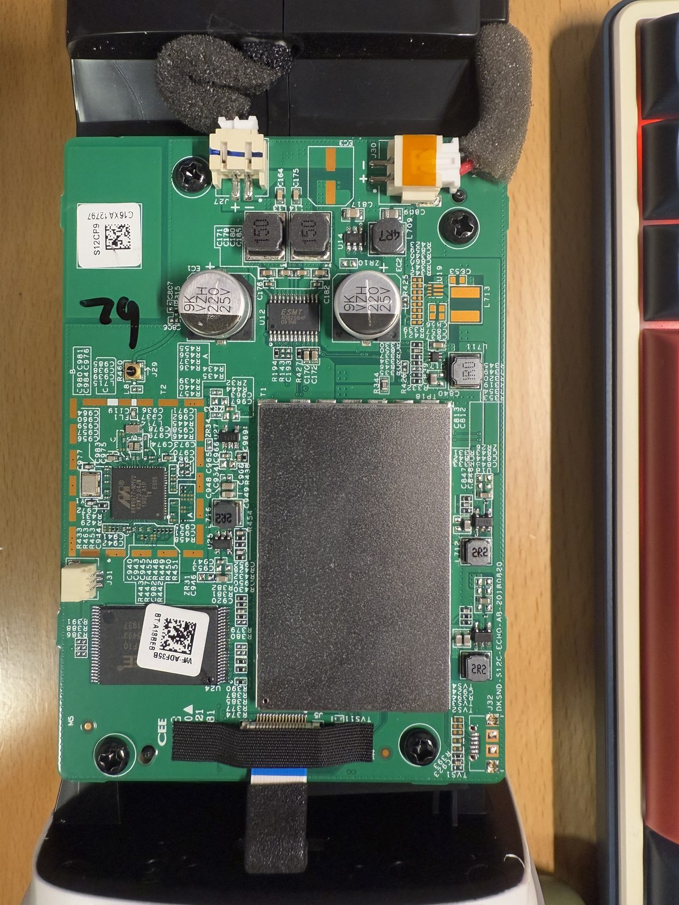

# 设备与准备

在准备软件之前，先确认手里的音箱和本项目的实测设备是否一致。产品型号、系统代号和 PCB 丝印并不完全相同；外观相似也不能证明固件与接口相同。

## 实测设备

**适用设备**：小米 AI 音箱（本项目实测机型，其他型号思路可参考但命令不能照搬）。实测硬件参数：

| 项 | 值 |
|---|---|
| 产品型号 | MDZ-25-DA |
| 系统 hostname / 内部代号 | S12A |
| PCB 丝印 | `DKSND-S12C-ECHO-AB-20180820` |
| 主控 SoC | Amlogic A113X（四核 Cortex-A53） |
| 内核 | Linux 4.9.61 (aarch64) |
| WiFi / 蓝牙 | Marvell 88W8977-NMV2，双频 Wi-Fi 4 (802.11 a/b/g/n) + Bluetooth 5.2（含 BLE） |
| 存储 | 江波龙（Longsys）FORESEE 品牌 SPI NAND，1Gb（128MB），存 OS / 固件 / 启动代码（分区布局见 [docs/concepts/boot-and-partitions.md](../concepts/boot-and-partitions.md)） |
| 音频 ADC | ES7243 |
| 麦克风采集 | PDM，设备 `/dev/snd/pcmC0D2c`（被 `mipns` 独占） |
| 调试串口 | 主板 JST 插座，115200 8N1 |

上图是拆开后的 S12A 主板参考，左下角白色 JST 插座为调试串口位置；不同批次的丝印和插座朝向可能略有差异，接线前先确认 `TX/RX/GND`。

> 型号标识有不一致：PCB 丝印是 `S12C-ECHO`、系统 hostname 是 `S12A`、产品型号是 `MDZ-25-DA`。这里如实并列，以实测为准。

**风险声明**：

- **需要拆机接串口，但不用焊接**——主板上有现成的 JST 串口插座,用杜邦线把 USB‑TTL 模块（如 CH340）的 `TXD/RXD/GND` 插上去即可。串口是打通 SSH 之前唯一的控制通道，也是刷写出错后唯一的救援通道。
- 过程涉及 **读写 NAND 系统分区**，操作失误可能导致设备无法启动（变砖）。本仓库操作手册都附带了备份和回退步骤，但请确保理解每条命令再执行，风险自担。
- 项目设计为保留小爱原有功能，但修改后的每套系统仍需实测；拆机与系统修改可能影响保修。

## 开始前应具备什么

| 准备项 | 用途 |
|---|---|
| 自有或获授权的音箱、稳定供电和网络 | 运行原生服务及所选云服务 |
| 开发电脑与 SSH 客户端 | 构建、传输文件和维护；主线不要求电脑常驻 |
| USB-TTL 与匹配插座的转接线 | 打通 SSH 前的入口，以及启动失败时的恢复通道 |
| 所选 LLM 的 API 密钥 | 音箱直连时写入设备私有配置；不能提交进仓库 |
| 已核验的固件备份与可用恢复路径 | 系统分区修改前的前提 |

端侧 TTS 构建需要 Rust、Zig 与 cargo-zigbuild；原生追问和本地判停还有各自的固件与构建依赖。需要哪个组件时，再进入对应说明，避免首次准备就安装全部工具。

小米识别与设备原生服务继续沿用音箱自身的联网环境。本项目无需额外的小米云账号轮询程序，这不意味着摆脱小米云依赖。

下一步：[从串口和 SSH 开始接入](../getting-started/bringup.md)。
